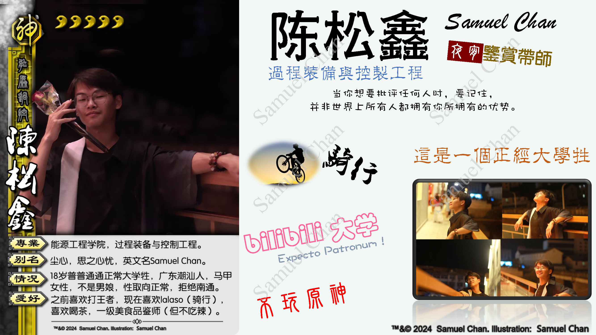
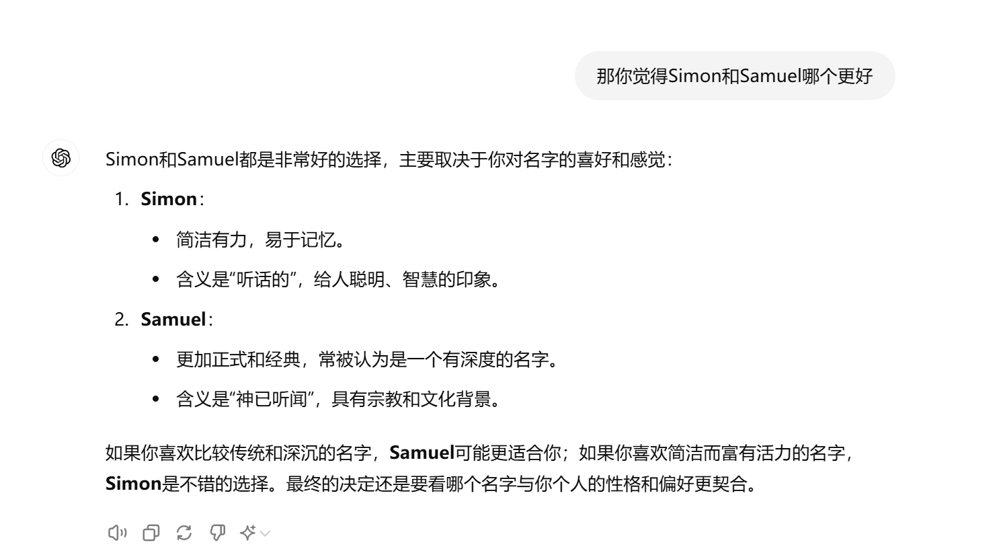
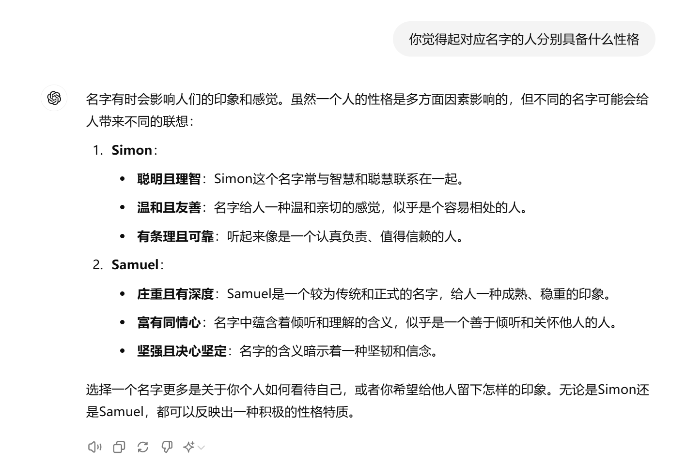
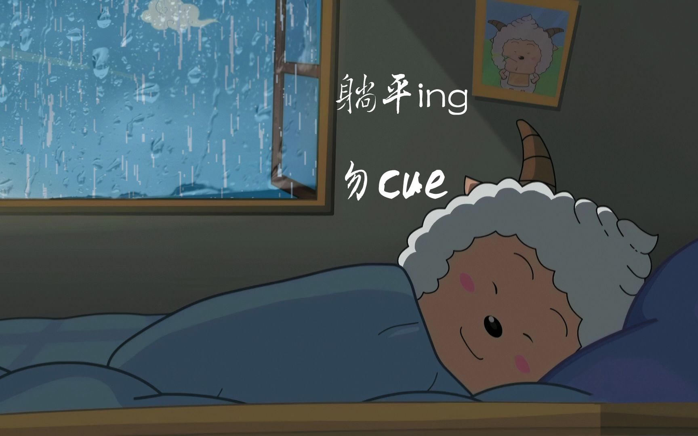
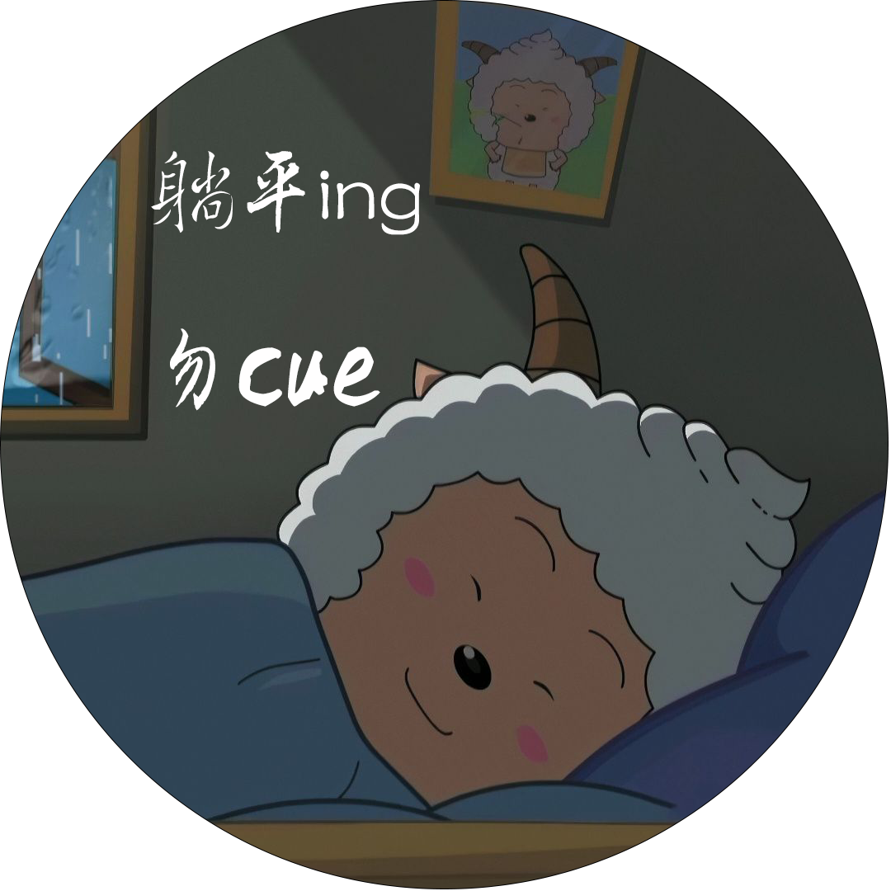

# :octicons-info-16:关于笔者

## 自述
我是浙江大学23级过控陈松鑫，英文名Samuel Chan，网名思之心忧or尘心，
普普通通的正常大学牲，"大小便正常，未来可期"，就是视力不太好，见谅。

我性格比较随和，但不随便，
或者说性格比较孤僻，没什么朋友，脾气也不太好，素质不详，食力不详。

我喜欢喝茶、美食、骑行、摄影（技术一般，网盘照片倒是屯了不少）等。
身为潮汕人，我的普通话也很普通，
但对美食有比较高的需求，自诩“夜宵鉴赏带师”。

笨人会玩魔方、转笔，下象棋，但都还是菜鸟水平，
有会的也可以欢迎和我交流交流，甚至指导指导在下。

空闲的时候，我喜欢吃吃喝喝lalaso，偶尔看书（看书能算空闲吗？不能吧:simple-dogecoin:）

下面是笔者自己做的非正式名片

??? note "名片"
    { width=90% }

其实我不擅于做自我介绍，也不喜欢自我介绍，在不正式的场合一般都只说“我是某某某”草草了之。
至于为啥，可参见下面的Q&A:fontawesome-regular-face-laugh-wink:。

## Q&A:fontawesome-regular-face-laugh-wink:

Q：这个网页是用来干啥的？   
A：这个网页全名The Website of Samuel Chan，简称WSC，顾名思义吗，
就是我的个人主页吧，但实际上这个只是我的一个分支，真正的个人主页我还没部署好。
这个网页，就像首页所说的，用来记录我整理的一些学习资料和记笔记吧，
当然还有平时写的日记和小作文，记录一些生活碎片。
有什么内容可以先看看目录，我之后会持续整理和更新，暂时这样子吧，我没构思好。

Q：那为什么会有这个网页？   
A：这个嘛，起初是在98看到了前辈分享的帖子里有这么一个MkDocs搭建的网页，
我觉得挺有意思，就去网上搜集了一些资料，学习起来了。
但我更想学的是Web开发，想要把个人主页搭建成自己想要的样子，
mkdocs平台搭建的网页更偏向于笔记吧。

Q：为何取名思之心忧？    
A：说来话长。初中时我比较仰慕王者荣耀比较火的一个职业选手梦之泪伤，
没错就是梦泪梦老师，当时的王者还没有多少英雄，我玩的技术也很一般，玩的频率不高吧，但很喜欢玩。
当时还幻想哪一天自己也能玩到出神入化的地步，自己出名了自然也得给自己起一个合适的名字，
而且以前我觉得名字不带字母或者符号，纯中文起的名字很酷，就模仿着"梦之泪伤"起了一个"思之心忧"，
这名字应该是全网唯一，而且缩写思心、心忧（同优秀的优）也挺好听的其实，而且我的名字里也有xin嘛。
但实际上也没有实现曾经的“鸿鹄之志”，现在技术也很菜，而且我不玩韩信了，太久没玩，生疏了。    

Q：那尘心呢？   
A：这也有一个故事或者说两个故事。尘心，这个名字看过斗罗大陆的应该都挺熟悉的。
在我初三、高中的时候，有一部动漫很火，就是唐家三少的斗罗大陆，
每周都在等星期六的到来，去看这一周一更的一集，追了几年才追完，但是结局有点烂尾，很可惜。
我最喜欢斗罗大陆里面的大陆最强攻击斗罗剑叔，也就是剑道尘心，别提多帅了，论魂技、攻击力、战斗风格、台词、建模、武器。   
&emsp;&emsp;“桂树青春百里疆，鹧鸪啼彻午阴凉。延平津上峰如削，剑去江空水自长。”
“七杀惊雷起，一剑破长空。”“杯中一阙十三弦，风雨半生，尽归一剑。”剑叔的台词，我也是信手拈来。
而且剑叔沉着淡定、自信稳重、实力不俗，某种程度上说，是我的理想型个人形象。
遗憾的是，剑叔的结局并不完美，在动漫里更是被轻描淡写地带过了。
当然，我也希望能找到我的挚友古榕，实力相当，虽然不时争斗，但彼此信任，目标一致。    
&emsp;&emsp;但是我并不是一开始就使用尘心这个网名的，这之间还有另一个故事。
在我高中的时候还看过一部叫做《且试天下》的古装剧，男主角丰兰息给自己起了马甲“黑丰息”，
女主角风惜云马甲“白风夕”，我觉得这种马甲命名方式很有意思，
正好我的名字的第一个和第三个字与“尘心”谐音，自此开始，我就开始使用“尘心”。     
&emsp;&emsp;因为尘心这个网名比较常见，所以我在一些要求唯一id的场景下就使用“思之心忧”。

Q：那Github的名字又为何是xinchen-sea？     
A： 由于尘心（chenxin）这个网名比较常见，而在某注册GitHub的时候，我还没有英文名Samuel，
故我给GitHub取名为心尘大海（[xinchen-sea](https://github.com/xinchen-sea)），
心尘大海又与星辰大海谐音，也表达了我对大海和未来的憧憬，
我也很喜欢海子的一句话“面朝大海，春暖花开”。
其实这也是我98的一个小号。

Q：可以讲讲关于英文名Samuel Chan的故事吗？     
A：当然，这个名字的由来呢，又是一个故事。
大家应该都知道歌手陈奕迅，广东人，他的英文名Eason Chan跟他的名字的粤语谐音。
Eason也是我喜欢的歌手之一，在大一暑假支教最后一天的离别会上，
我和当地的一个干事合唱了Eason的粤语歌，回学校之后就萌生了起英文名的想法。
我的名字的粤语也挺好听的嘛，想着根据发音起一个相对文艺点的名字。
我自己肯定没有这样子的才华，请教了我的大英老师，专业的人就是不一样，
她给了我几个建议，Samuel、Sam、Simon等，
在chatGPT的帮助下，一番掂量琢磨之后，我决定选择使用Samuel，
当然这个名字也可以简称Sam。

{ width=50% } &emsp; { width=40% }

Q：为何你的社交帐号性别都是女？    
A：好问题，之前我也不知道什么时候开始就陆陆续续把各种社交帐号性别改成“女”了，
可能单纯觉得好玩，也可能因为有些时候我絮絮叨叨的，
话很多， 从我这么长的自述应该也能看出来我话多[戳手.gif]，
而且比较腼腆，矫情，我觉得我像个女生。
后来我得到了相对满意的答案“码农+二次元头像+性别女=男”，
原来的版本是“妓院+二刺螈+性别女=男”，因为我不是计院的，二次元浓度也比较低，
就给出了属于自己的答案。

Q：98头像似乎不那么二次元？   
A：懒羊羊从某种程度上说也算二次元吧，这个头像本来是一张表情包，
被我改成了电脑桌面壁纸（躺平，勿cue），随即演化成了头像。

附：表情包&头像
??? note "表情包"
    

??? note "头像"
    

Q：既然你是二次元，那你真的不玩原神吗？   
A：二次元不知什么时候就成了一个标签或者说代名词，
而原神为代表的米哈游最为突出，“不玩原神”就是正话反说，
玩一下梗吧。不过我的浓度还是比较低的，我玩的少，
虽然我还是原铁双修/:doge。

Q：你好像还玩王者荣耀，什么段位？玩什么分路？   
A：技术比较菜，现在也不怎么玩了，感觉很无聊。
段位的话，我刚上王者，
五条路都玩，以前玩中路，主玩貂蝉，干将莫邪，诸葛亮，
后来玩打野多些，玩曜和云中君，但感觉有些乏力，
现在主要玩对抗路吧，主要玩关羽（都是自家兄弟，理所应当，不必多盐），不过很菜。

## 我的故事
我就普普通通的大学牲，大学也没谈过恋爱，也没什么故事。

!!! info "温馨提示"
    个人记录，或许带有个人情绪，理想化等因素，不建议看  
    真的想看的话可以点击[这里](my-story.md)跳转

