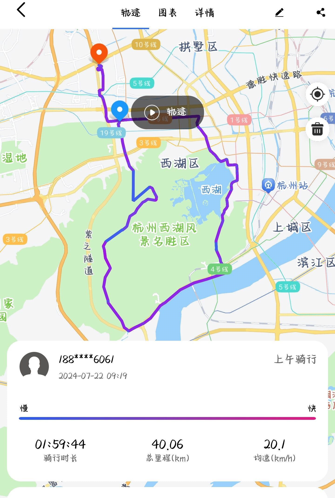

    <b>文章内容半虚半实，请自行辨析</b>     

### <b>导语</b>
&emsp;&emsp; 7.22日清晨，我与教练开启了长达40公里的骑行，小有此记。
现实与想象交织，把小作文编织成了小小说。

<h2>前一天晚上</h2>

### <b>序章</b>

&emsp;&emsp; “教练，明天几点？”       
&emsp;&emsp; “明天骑车不？ :smile: 要么早点过来练车，练完一起去骑车；要么早点去骑，骑完回来来练车。”        
&emsp;&emsp; “早点去骑吧，练完再骑太热了。您早上有别的学员吗？”      
&emsp;&emsp; “就你一个人！[偷笑] vip！你明天最早能几点过来？”      
&emsp;&emsp; “好，六七点吧。我骑的比较菜，教练让让我。”        
&emsp;&emsp; …………   

<h2>第二天</h2>

### <b>启程</b>
      
&emsp;&emsp; 清晨的第一缕阳光透过窗帘，唤醒了沉睡的大地。六点左右，我起床洗漱，站在窗台上 
凝视着那抹温暖但不刺眼的橙黄，心中涌起一股莫名的冲动。今天，我将和教练踏上一段长达40公里的骑行之旅，
去感受风的温柔，去追逐自由的翅膀。           
&emsp;&emsp; “老弟，起床没？驾校等你！”      
&emsp;&emsp; “刚洗漱完，准备出发！”     
&emsp;&emsp; 我整装启程，踏上了去往驾校的道路。
车轮缓缓转动，带动着心跳的节奏。初夏的微风拂过脸颊，带来一丝清凉。
道路两旁的绿树在晨光中摇曳生姿，仿佛在祝福我一路顺风。        
&emsp;&emsp; 当我踏入驾校大门时，教练已经大树下等候。随即他递给了我一杯水，接过水之后，
教练跟我说了 一下今天的两条路线，我选择了爬坡但风景美的那条路线。我调试好骑行设备，打开手机记录app，
耳机放着喜欢的音乐，感到轻松惬意。在教练一句“那你跟着我骑，跟不上的时候打三下车铃” 之后，
我们就此出发，在清晨微抚的夏风中，开启了我们今日的40公里骑行。          
&emsp;&emsp; 晨光微露，我们轻骑而出，仿佛跃入了一幅未完的水墨画卷，墨色与光影交织，
勾勒出世界最初的温柔。车轮轻转，带走了城市的喧嚣，只余下风的低语与心的吟唱，在空旷的天地间回响。          
&emsp;&emsp; …………

### <b>爬升</b>
&emsp;&emsp; 虽然还只是清晨，但炕州的太阳已经高高挂起。
我们在晨曦的车流中穿行，很快就迎来了今天的第一大挑战——爬坡。
（bgm：太阳出来我爬山坡 /doge（:octicons-x-16:）        
&emsp;&emsp;  “前面用小盘，后面挂大盘。走！”        
&emsp;&emsp; 我们开始沿着蜿蜒的山路缓缓前行，道路两旁的树木郁郁葱葱，绿叶在微风中摇曳，
似乎在为我们的旅程加油鼓劲。阳光透过树梢，斑驳地洒在他的身上，金色的光斑随着我们骑行的步伐跳跃，
像是一群顽皮的精灵在追逐打闹。 爬过第一段坡，教练说到“过了这个隧道，还要再爬两段，坚持住。”        
&emsp;&emsp; 随着时间的推移，坡度逐渐增加，我们的速度也随之减慢。
我的呼吸变得急促，汗水顺着头盔滑落，我渐渐感到力竭。爬升到最后一段坡时，我们遇到了一位老者，
教练喊道：“坚持住，不要放弃！老人家都没有轻易放弃，你有什么理由放弃！加油！”
与老者擦肩而过时，教练也鼓励到：“加油！坚持！”      
&emsp;&emsp; 教练到达顶端之后，跟我说：“加油，第一次骑，骑不动就下车慢慢推上来，加油！”
车轮在陡峭的路面上滚动，发出节奏感强烈的声响，像是战鼓在催促着战士前进。
我咬紧牙关，使劲向前踩踏板，不断挑战着极限，每一次的向上爬升都像是在与命运抗争。     

<figure markdown="span">
  { width="300" }
  <figcaption>找了张图凑合一下</figcaption>
</figure>

&emsp;&emsp; 到达最高点之后，我们稍作休息，
我深深地吸了一口气，感受着来自顶峰的清新空气。
那一刻，所有的疲惫仿佛都被风吹散，水入豪肠，心中是无尽的喜悦和满足。        
&emsp;&emsp; “第一次骑就爬上来了，已经很厉害了，我第一次来的时候还是推上来的。”教练言语间露着
满意和骄傲，“从这个隧道下去之后，就是一段下坡了，这段路的风景很美。”
我点点头，再抿了一口水，再次跟随教练出发。         
&emsp;&emsp; …………     

### 冲破
&emsp;&emsp; 通过隧道后，我们眼前看到的是一爿龙井绿海和山庄。
这里的风景如同一幅精美的画卷，缓缓展开。茶园里绿色的波浪，山峦间翠绿的森林，
还有那些不经意间闯入眼帘的野花，都在诉说着大自然的美丽与和谐。
我们停下车，深呼吸，将这一切尽收眼底。
教练说：“我看你朋友圈喜欢写一些小作文之类的，来我给你拍两张。”
随即，他拿出手机，给我拍了照和录制了视频。/doge    

<figure markdown="span">
  { width="300" }
  <figcaption>瞭望</figcaption>
  { width="300" }
  <figcaption>冲锋</figcaption>
</figure>

&emsp;&emsp;之后，我们开始继续前进，让教练录制了下坡视频。       
&emsp;&emsp;简单剪辑了一下，骑行录制的有些抖动。   

    <video width="560" height="315" controls="controls">
        <source src="video1.mp4" type="video/mp4">
        <source src="video1.webm" type="video/webm">
    </video>

     <a href="https://www.bilibili.com/video/BV1Xb421n76c/?spm_id_from=333.337.search-card.all.click&vd_source=1c34606945ec9fdc94b5ac937f274689" target="_blank">我始终认为青春不需要恋爱也会热烈</a>

&emsp;&emsp; 下坡，是速度的释放，是热情的激荡，是自由的呼唤，是心跳的回响。
我并不满足于自由下滑的速度，于是切换3*7挡，向下加速后再滑行，
体验着速度与激情的完美结合。山风在耳边呼啸，带来速度的快感，它似乎在诉说着大山与茶园的故事，
告诉我这座山这片绿海的庄严与缠绵。    
&emsp;&emsp; 沿途，野花如繁星点点，以大自然最绚烂的笔触，点缀着这趟旅程的每一个瞬间。
在其间快速穿梭，如同进入仙境，每一次呼吸都吸入了自然的芬芳与诗意，心灵得以在尘嚣之外翩翩起舞。
随着坡度变缓，我们速度逐渐放慢，享受着下坡的轻松与愉悦，先前上坡的疲惫也随着山风消散。      
&emsp;&emsp; …………

### 沿江、环湖
&emsp;&emsp; 骑行至此，路途过半。下坡之后的路都为平地，我们先是沿钱塘江骑行几公里，
接着是绕西湖景区骑了一圈，从南到北，从西到东。       
&emsp;&emsp; 骑行在钱塘江畔，感受着江水的波涛和历史的沉淀。清晨的薄雾轻抚着江面，
阳光透过云层，洒下金色的光辉，照亮了前行的道路。我们沿着江岸线，在徐徐江风与熹微晨光之间穿梭。          
&emsp;&emsp; 随着骑行的深入，西湖的美景逐渐映入眼帘。湖面平静如镜，倒映着蓝天白云和周围的山峦。
我们沿着湖边绿树成荫的林荫道，时而穿过古朴的石桥，时而绕过荷花盛开的池塘。
西湖的十景，如断桥残雪、平湖秋月、苏堤春晓等，一幅幅动人的画卷在我们眼前一一展现。     
&emsp;&emsp; 车辆的轮廓在初升的阳光下变得柔和而清晰。发动机的轰鸣声不断响起，
轮胎与路面的摩擦声也变得清晰可闻。车辆的流动愈来愈频繁，公交车、出租车、私家车，
各种各样的车辆在街道上穿梭，形成了一条条流动的彩带。它们在城市的各个角落，
连接着人们的家和工作地点，承载着每个人的梦想和希望。    
&emsp;&emsp;…………       

### 终点
&emsp;&emsp; 不知不觉，我们已经骑了三十多公里。阳光洒满大地，我们开始踏上归途，
穿梭在繁忙的都市街道上，沐浴在阳光和微风中，享受着大自然的恩赐。    
&emsp;&emsp; 在途中，我冒起一个思想火花，决定写下这篇小记，记录这段美好时光，对教练说：
“教练，我想好了小作文标题了，就叫**‘离合压不稳是吧，走，带你练腿去’**。”       
&emsp;&emsp; 不知道穿过了多少个路口，我和教练在学校门前的红绿灯路口分别，回到各自的目的地。
回望这一路的足迹，心中充满了满足和自豪。在教练的带领下，我达到了20的配速。
40公里的旅程，不仅是一段距离的跨越，更是一次心灵的洗礼。
被汗水浸湿的身躯，夹杂的是40公里的坚持与胜利的喜悦。       
&emsp;&emsp;…………

<figure markdown="span">
  { width="300" }
  <figcaption>里程记录</figcaption>
</figure>

### 结语
&emsp;&emsp; 车轮轻转，留下一串串足迹，如同诗行，记录下我们的旅程。
我骑着山地车缓缓回到宿舍。这次旅途，如同一颗颗璀璨的珍珠，串联起我生命中的一段美好记忆。
骑行，不仅是一场身体上的运动，更是一次心灵的旅行。它让我懂得了坚持的意义，体验了自由的力量，
更加珍惜眼前的美好与未来的无限可能。    
&emsp;&emsp; 骑行，是对自我的挑战，也是对极限的赞颂，是青春的热血沸腾与激情荡漾。
今日，我们超越了昨日的自己，书写了新的篇章。青春，不需要恋爱，依旧可以热烈。      
&emsp;&emsp;……歇息过后，我便前往驾校开始今日的练习。

  - End -

