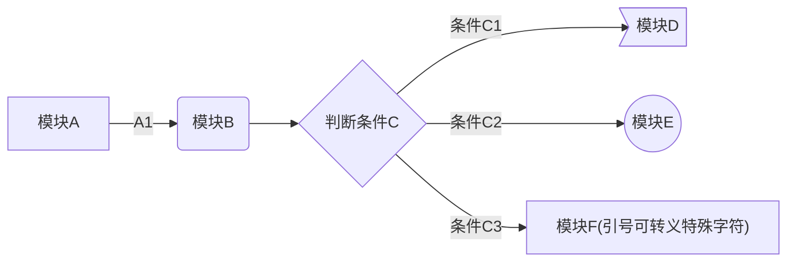
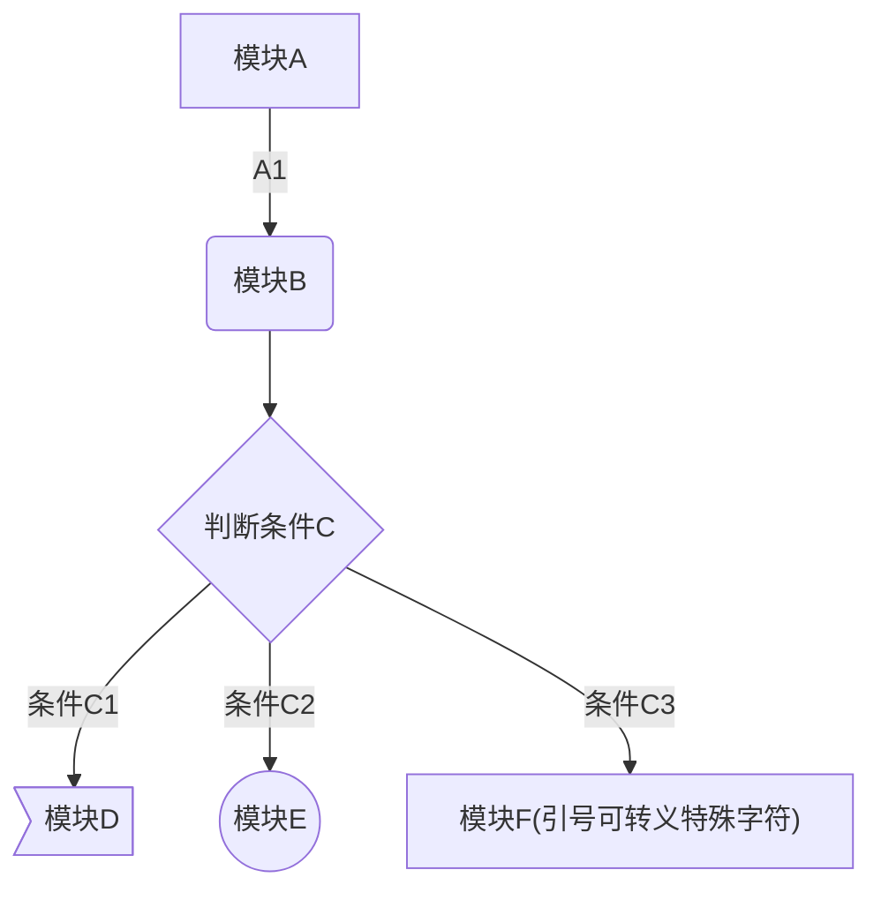
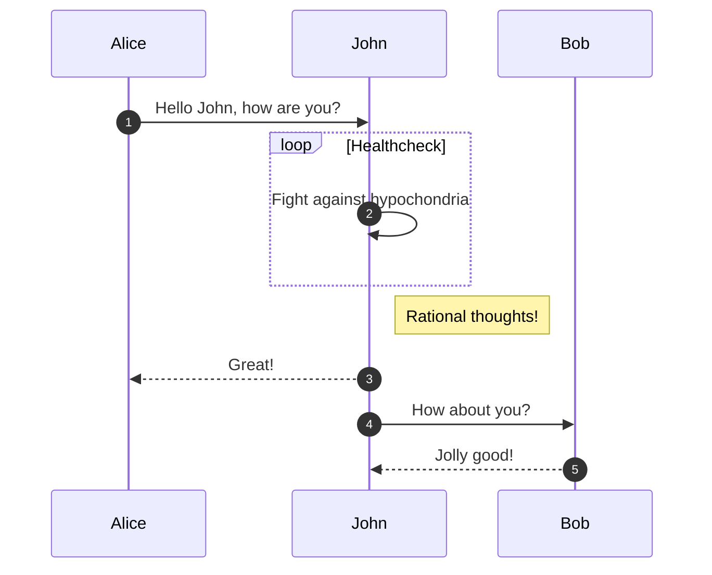
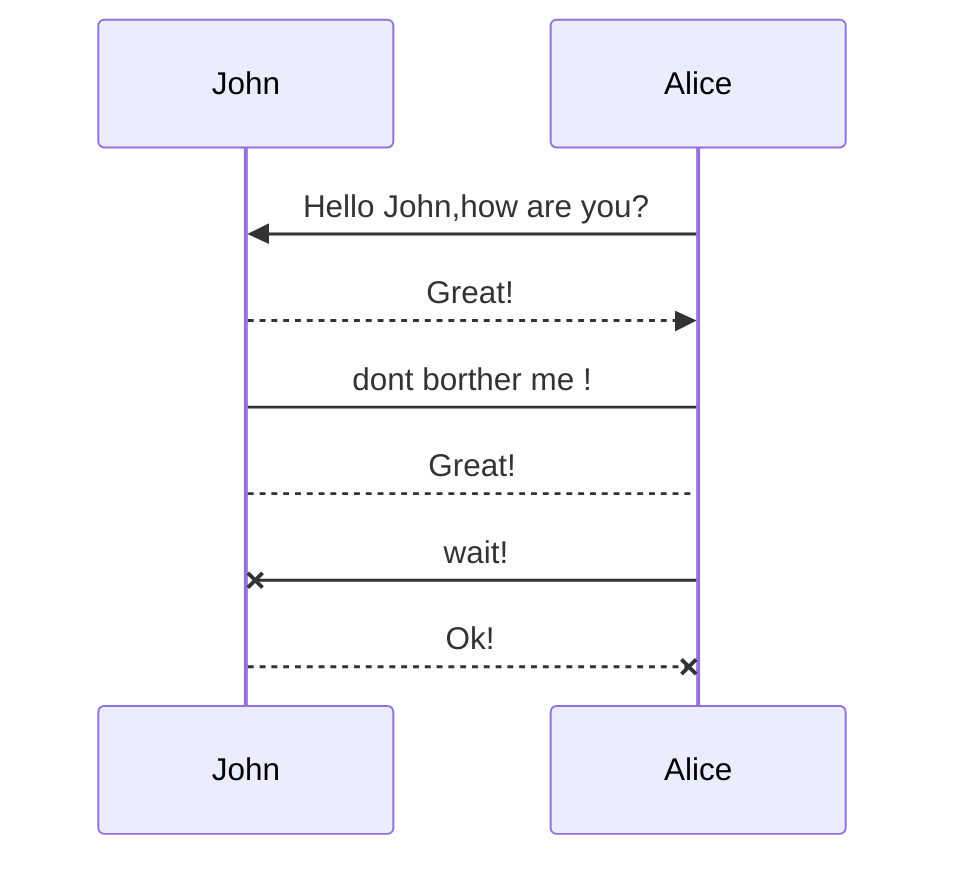
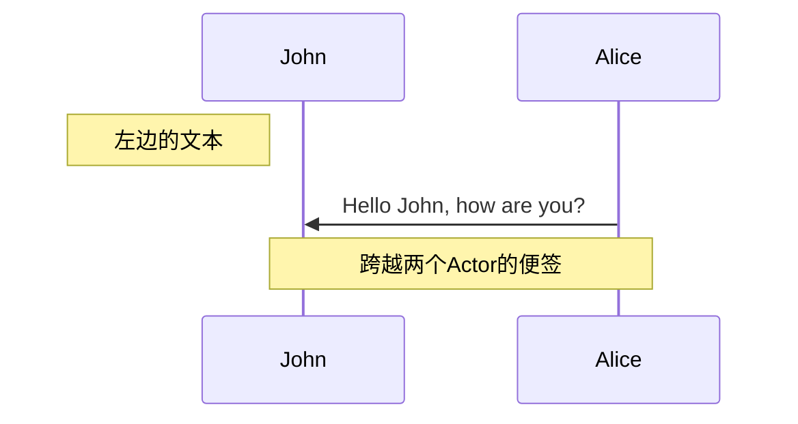
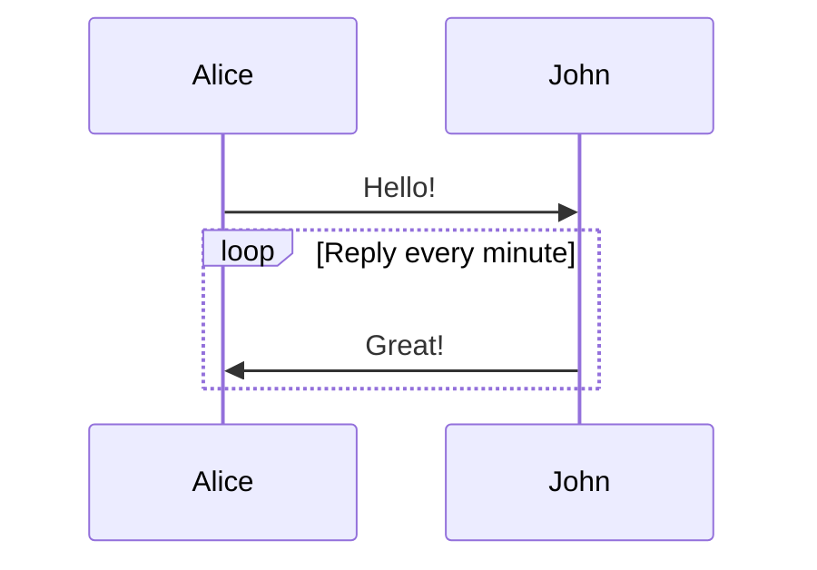
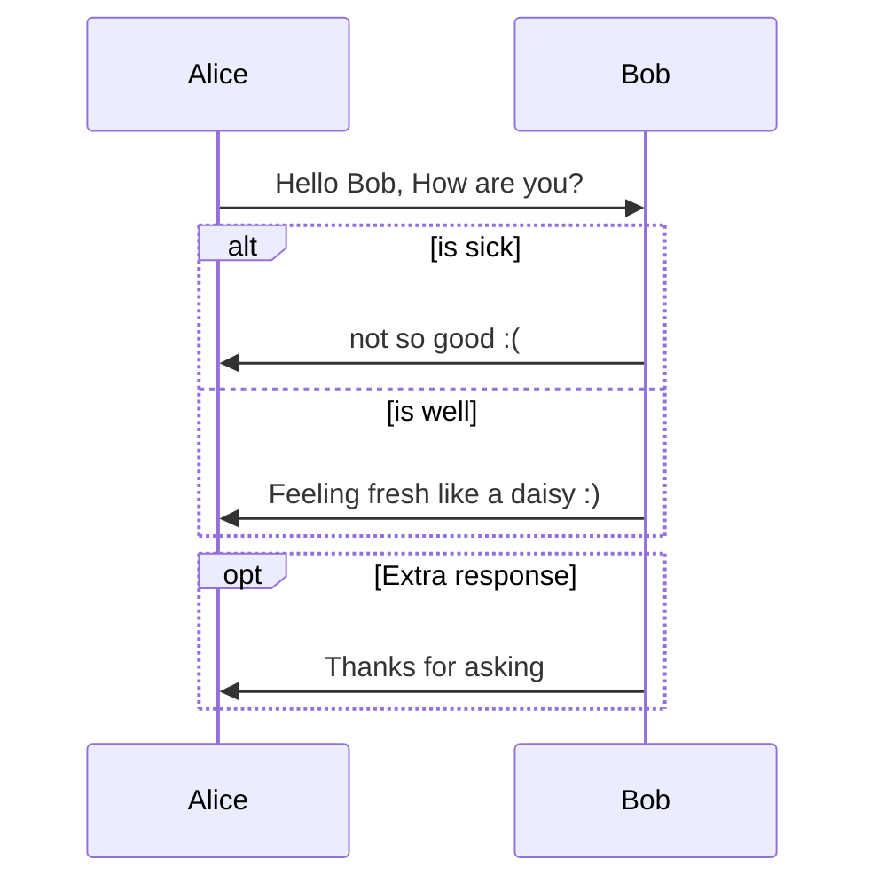
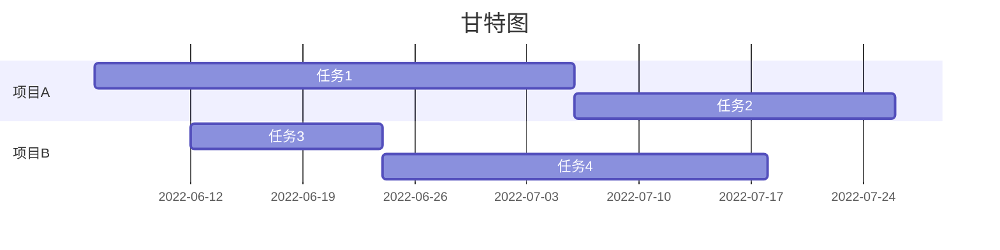
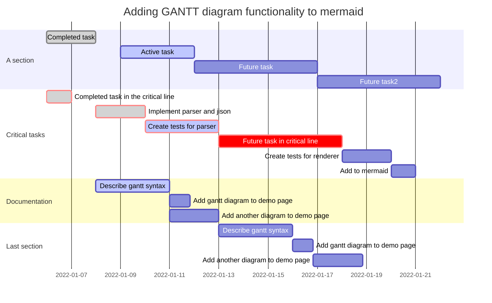
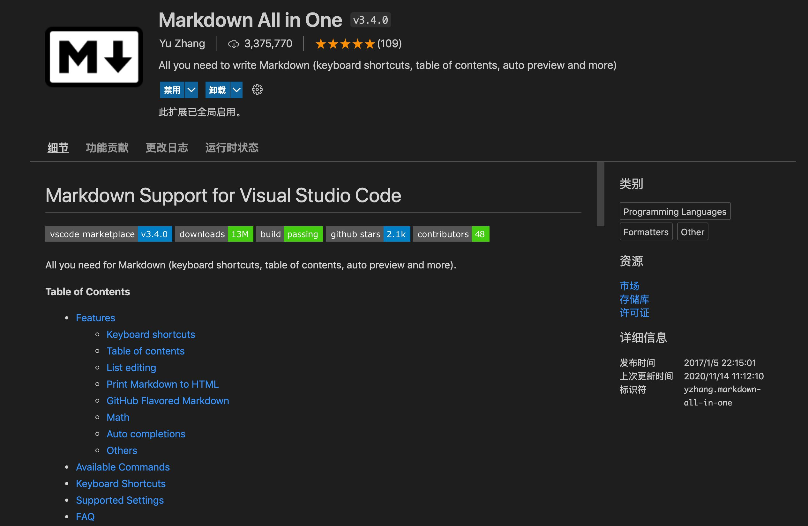

## Markdown简介
&emsp;&emsp;Markdown是一种轻量级标记语言，创始人为约翰·格鲁伯（英语：John Gruber）。 它允许人们使用
易读易写的纯文本格式编写文档，然后转换成有效的XHTML（或者HTML）文档。

&emsp;&emsp;由于Markdown的轻量化、易读易写特性，并且对于图片，图表、数学式都有支持，许多网站都广泛
使用Markdown来撰写帮助文档或是用于论坛上发表消息。

**另一个版本的简介：**

&emsp;&emsp;Markdown是一种轻量级标记语言，排版语法简洁，让人们更多地关注内容本身而非排版。
它使用易读易写的纯文本格式编写文档，可与HTML混编，可导出 HTML、PDF 以及本身的 .md 格式的文件。
因简洁、高效、易读、易写，Markdown被大量使用，如Github、Wikipedia等网站，如各大博客平台：WordPress、Drupal、简书等。

&emsp;&emsp;千万不要被「标记」、「语言」吓到，Markdown的语法十分简单，常用的标记符号不超过十个，
用于日常写作记录绰绰有余，不到半小时就能完全掌握。就是这十个不到的标记符号，却能让人优雅地沉浸式记录，
专注内容而不是纠结排版， 达到「心中无尘，码字入神」的境界。

> 标记语言：通过”标记符号“设定表现效果、内容结构、数据格式等，例如：HTML、XML等。

如果觉得下文繁琐，可以查看[速查表](https://markdown.com.cn/cheat-sheet.html#%E6%80%BB%E8%A7%88)

## 语法
### 标题
格式：x个`#` + `空格` + `标题`  
或者：在文本下方添加任意数量的==标识一级标题，-标识二级标题
```md title="标题的定义"
#一级标题
## 二级标题
### 三级标题
#### 四级标题
##### 五级标题
###### 六级标题
或者：
一级标题
===
二级标题
---
```

### 列表
有序列表和无序列表两种形式：

- 无序列表使用*或+或-标识
- 有序列表使用数字加.标识，例如：1.

1. 无序列表
    - 二级列表项
    - 二级列表项
         - 三级列表项，按Tab缩进即可
         - 三级列表项，其实就是前面添加4个空格
2. 有序列表
    1. 第一项
    2. 第二项

```md title="列表定义"
- + * 号均可以定义列表项
- 无序列表
- 有序列表
+ 无序列表
+ 有序列表
* 无序列表
* 有序列表
```
### 代码
#### 代码片段
段落上的一个函数或片段的代码可以用一对反引号(\`)（Esc键下面那个）把它包起来，例如：
`print()` 函数
#### 代码区块
用三个或更多\`或者三个\~都可以定义代码区块，还可以选择语言种类，对代码进行高亮显示,部分编译器不支持\~   
与mkdocs使用的[代码块](https://squidfunk.github.io/mkdocs-material/reference/code-blocks/)有一些差异，具体自己摸索。

````md 
 ```语言种类 格式设置
代码块内容……
 ```
````

tips：语法高亮

许多Markdown处理器都支持受围栏代码块的语法突出显示。使用此功能，您可以为编写代码的任何语言添加颜色突出显示。
要添加语法突出显示，请在受防护的代码块之前的反引号旁边指定一种语言。

### 文本
#### 分段和换行
文本分段，前后至少保留一个空行。或者采用html格式`<p></p>`。   
换行的话可在前一行文字末端加入`<br>`或者加上几个空格强制换行。

!!! note
    这两种效果不一样，一种只是换行，另一种是分段。两者的段落间距是不相同的。

#### 加粗或斜体
1. 粗体：用一对两个`*`（星号）将想要**加粗**的字体包围起来即可得到粗体

2. 斜体：用一对一个`*`（下划线）将想要*变斜*的字体包围起来即可得到斜体

3. 粗斜体：用一对三个`*`（下划线）将想要***加粗变斜***的字体包围起来即可得到粗斜体

```md title="字体格式"
**加粗**
*斜体*
***粗斜体***
```
#### 线条
1. 水平分隔线：在单独一行使用三个或多个`*`（星号）、`-`（短横）或者`_`（下划线）

***

```md title="分隔线"

***

___

---

```
!!! note "区分"
    `---`上一行有文字时，`-`标识二级标题，无文字时，`-`表示水平分割线  
    所以，考虑到兼容性，请在使用`---`时前后添加空白行

2. 删除线：前后各两个`~~` 例如：~~原价：100~~
```md title="删除线"
~~原价：100~~
```
3. 下划线：和HTML的标签相同 例如：<u>下划线</u>
```html title="下划线"
<u>下划线</u>
```
####  符号
参照下表：

| 符号 |   说明    | 对应编码(使用时去掉空格) |           英文           |
|:--:|:-------:|:-------------:|:----------------------:|
| &  |  AND符号  |    & amp;     |       ampersand        |
| <  |   小于    |     & lt;     |         little         |
| >  |   大于    |     & gt;     |         great          |
|    |   空格    |    & nbsp;    |      number space      |
| ¿  |   倒问号   |   & iquest;   |   inverted question    |
| ?  |   问号    |   & quest;    |        question        |
| «  |  左书名号   |   & laquo;    |    left angle quote    |
| »  |  右书名号   |   & raquo;    |   right angle quote    |
| "  |   引号    |    & quot;    |         quote          |
| ‘  |  左单引号   |   & lsquo;    |   left single quote    |
| ’  |  右单引号   |   & rsquo:    |   right single quote   |
| “  |  左双引号   |   & ldquo:    |   left double quote    |
| ”  |  右双引号   |   & rdquo:    |   right double quote   |
| ¶  |  段落符号   |    & para;    |       paragraph        |
| §  |   章节符   |    & sect;    |        section         |
| ×  |   乘号    |   & times;    |         times          |
| ÷  |   除号    |   & divide;   |         divide         |
| ±  |   加减号   |   & plusmn;   |       plus minus       |
| ƒ  |   函数    |    & fnof;    |        function        |
| √  |   根号    |   & radic;    |         radic          |
| ∞  |   无穷大   |   & infin;    |        infinite        |
| °  |    度    |    & deg;     |         degree         |
| ≠  |   不等号   |     & ne;     |           ne           |
| ≡  |   恒等于   |   & equiv;    |       equivalent       |
| ≤  |  小于等于   |     & le;     | less than or equal to  |
| ≥  |  大于等于   |     & ge;     | great than or equal to |
| ⊥  |  垂直符号   |    & perp;    |     perpendicular      |
| ←  |   左箭头   |    & larr;    |       left arrow       |
| →  |   右箭头   |    & rarr;    |      right arrow       |
| ↑  |   上箭头   |    & uarr;    |        up arrow        |
| ↓  |   下箭头   |    & darr;    |       down arrow       |
| ↔  |  水平箭头   |    & harr;    |    horizontal arrow    |
| ↕  |  竖直箭头   |    & varr;    |     vertical arrow     |
| ⇐  |  双线左箭头  |    & lArr;    |       left arrow       |
| ⇒  |  双线右箭头  |    & rArr;    |      right arrow       |
| ⇑  |  双线上箭头  |    & uArr;    |        up arrow        |
| ⇓  |  双线上箭头  |    & dArr;    |       down arrow       |
| ⇔  | 双线水平双箭头 |    & hArr;    |    horizontal arrow    |
| ⇕  | 双线竖直箭头  |    & vArr;    |     vertical arrow     |
| ♠  |   黑桃    |   & spades;   |         spades         |
| ♥  |   红桃    |   & hearts;   |         hearts         |
| ♣  |   梅花    |   & clubs;    |          club          |
| ♦  |   方块    |   & diams;    |        diamonds        |
| ©  |   版权    |    & copy;    |       copy right       |
| ®  |  注册商标   |    & reg;     |      registration      |
| ™  |   商标    |   & trade;    |         trade          |
| ¥  |   人民币   |    & yen;     |          rmb           |
| €  |   欧元    |    & euro;    |          euro          |
| ¢  |   美分    |    & cent;    |          cent          |
| £  |   英磅    |   & pound;    |         pound          |
| ½  |  二分之一   |   & frac12;   |        fraction        |
| ¼  |  四分之一   |   & frac14;   |        fraction        |
| ‰  |  千分符号   |   & permil;   |       per mille        |
| ∴  |   所以    |   & there4;   |       there fore       |
| π  |   圆周率   |     & pi;     |           pi           |
| ¹  |   商标1   |    & sup1;    |        super 1         |
| α  |  alpha  |   & alpha;    |         alpha          |
| β  |  beta   |    & beta;    |          beta          |
| γ  |  gamma  |   & gamma;    |         gamma          |
| δ  |  delta  |   & delta;    |         delta          |
| θ  |  theta  |   & theta;    |         theta          |
| λ  | lambda  |   & lambda;   |         lambda         |
| σ  |  sigma  |   & sigma;    |         sigma          |
| τ  |   tau   |    & tau;     |          tau           |

#### emoji :smile:
有两种方法可以将表情符号添加到Markdown文件中：
将表情符号复制并粘贴到Markdown格式的文本中，或者键入emoji shortcodes。

1. 复制和粘贴表情符号    
在大多数情况下，可以简单地从[Emojipedia](https://emojipedia.org/)等来源
复制表情符号并将其粘贴到文档中。
许多Markdown应用程序会自动以Markdown格式的文本显示表情符号。
从Markdown应用程序导出的HTML和PDF文件应显示表情符号。    
Tip: 如果您使用的是静态网站生成器，请确保将HTML页面编码为UTF-8。   

2. 使用表情符号简码      
一些Markdown应用程序允许通过键入表情符号短代码来插入表情符号。   
通常以冒号开头和结尾，并包含表情符号的名称。  
例如：:smile: 的代码如下
```md title="emoji用法"
:smile:
```
Note: 您可以使用此[表情符号简码列表](https://gist.github.com/rxaviers/7360908)，
或者参考：https://www.webfx.com/tools/emoji-cheat-sheet/    
但请记住，表情符号简码因应用程序而异。有关更多信息，请参阅Markdown应用程序的文档。

#### 转义字符
使用反斜杠\插入语法中用到的特殊符号。在Markdown中，主要有以下几种特殊符号需要处理：
```md
\ 反斜线
` 反引号
* 星号
_ 底线
{} 花括号
[] 方括号
() 括弧
#井字号
+ 加号
- 减号
. 英文句点
! 惊叹号
```
例如，如果你需要插入反斜杠，就连续输入两个反斜杠即可：`\\` => \\ 。

注：在内容中输入以上特殊符号的时候一定要注意转义，否则将导致内容显示不全，甚至排版混乱。

#### 数学公式
默认下的分隔符：

- `$...$` 或者 `\(...\)` 中的数学表达式将会在行内显示。
- `$$...$$` 或者 `\[...\]` 或者 ```math 中的数学表达式将会在块内显示。(有些编译器不支持这种编译方式)

例如：   
欧拉公式：&nbsp; $e^{i&pi;} + 1 = 0$   
```md title="欧拉公式代码"
欧拉公式:  $e^{i&pi;} + 1 = 0$   
```
单行公式：&nbsp; $f(x) = sinx + cosx$
```md
单行公式：  $f(x) = sinx + cosx$
```

多行公式：
$\mathbf{V}_1 \times \mathbf{V}_2 = 
\begin{vmatrix} \mathbf{i} & \mathbf{j} & \mathbf{k} \\
\frac{\partial X}{\partial u} & \frac{\partial Y}{\partial u} & 0 \\
\frac{\partial X}{\partial v} & \frac{\partial Y}{\partial v} & 0 \\
\end{vmatrix}$
```md
多行公式：
$$\mathbf{V}_1 \times \mathbf{V}_2 = 
\begin{vmatrix} \mathbf{i} & \mathbf{j} & \mathbf{k} \\
\frac{\partial X}{\partial u} & \frac{\partial Y}{\partial u} & 0 \\
\frac{\partial X}{\partial v} & \frac{\partial Y}{\partial v} & 0 \\
\end{vmatrix}$$
```
更多的可以参考[LaTex入门](LaTex.md)。

#### 脚注

&emsp;&emsp;脚注使您可以添加注释和参考，而不会使文档正文混乱。当您创建脚注时，带有脚注的上标数字会出现在您添加脚注参考的位置。 
读者可以单击链接以跳至页面底部的脚注内容。   
&emsp;&emsp;要创建脚注参考，请在方括号（`[^1]`）内添加插入符号和标识符。
标识符可以是**数字或单词**，但不能包含空格或制表符。标识符仅将脚注参考与脚注本身相关联。在输出中，脚注按顺序编号。   
&emsp;&emsp;在括号内使用另一个插入符号和数字添加脚注，并用冒号和文本（`[^1]: 脚注内容。`）。

示例：  

```md
&emsp;&emsp;稀土就是化学元素周期表中镧系元素[^1]以及与镧系元素密切相关的元素—钇(Y)和钪(Sc)共17种元
素，称为稀土元素[^footnote]。
[^1]: 镧(La）、铈(Ce）、镨(Pr）、钕(Nd）、钷(Pm）、钐(Sm）、铕(Eu）、钆(Gd）、铽(Tb）、镝(Dy）、钬(Ho）、铒(Er）、铥(Tm）、镱(Yb）、
镥(Lu）。
[^footnote]: 这是一个脚注。
```

代码输出结果如下：  
&emsp;&emsp;稀土就是化学元素周期表中镧系元素[^1]以及与镧系元素密切相关的元素—钇(Y)和钪(Sc)共17种元
素，称为稀土元素[^footnote]。
[^1]: 镧(La）、铈(Ce）、镨(Pr）、钕(Nd）、钷(Pm）、钐(Sm）、铕(Eu）、钆(Gd）、铽(Tb）、镝(Dy）、钬(Ho）、铒(Er）、铥(Tm）、镱(Yb）、
镥(Lu）。
[^footnote]: 这是一个脚注。

### 引用
1. 常规引用：要创建块引用，可以在段落前添加一个` > `符号(空格可加可不加)。
  > 冬天来了，春天还会远吗？   —— 雪莱

  ```md title="代码"
  > 冬天来了，春天还会远吗？   —— 雪莱
  ```

2. 多个段落的块引用：块引用可以包含多个段落。
为段落之间的空白行添加一个` > `符号。
  > 这里是第一段。
  > 
  > 这里是第二段。

  ```md title="代码"
  > 这里是第一段。
  > 
  > 这里是第二段。
  ```

3. 嵌套块引用：
块引用可以嵌套。在要嵌套的段落前添加一个 >> 符号。

4. 带有其它元素的块引用：
块引用可以包含其他 Markdown 格式的元素。
并非所有元素都可以使用，你需要进行实验以查看哪些元素有效。

    > 还可以在引用内，嵌套引用
    >> - 引用内可以包含列表等元素

- 列表中也可以嵌套引用
> to be or not to be，it is a question。

### 链接
#### 链接语法
链接文本放在中括号内，链接地址放在后面的括号中，链接title可选。

超链接Markdown语法代码：`[超链接显示名](超链接地址 "超链接title")`

对应的HTML代码：`<a href="超链接地址" title="超链接title">超链接显示名</a>`

```md
这是一个链接 [Markdown语法](https://markdown.com.cn)。
```

渲染效果如下：

这是一个链接 [Markdown语法](https://markdown.com.cn)。

#### 给链接增加 Title

链接title是当鼠标悬停在链接上时会出现的文字，这个title是可选的，它放在圆括号中链接地址后面，跟链接地址之间以空格分隔。


```md
这是一个链接 [Markdown语法](https://markdown.com.cn "最好的markdown教程")。
```

渲染效果如下：

这是一个链接 [Markdown语法](https://markdown.com.cn "最好的markdown教程")。

#### 网址和Email地址

使用尖括号可以很方便地把URL或者email地址变成可点击的链接。

```md
<https://markdown.com.cn>

<fake@example.com>
```

渲染效果如下：

<https://markdown.com.cn>

<fake@example.com>

#### 带格式化的链接

**强调**链接, 在链接语法前后增加星号。 要将链接表示为`代码`，请在方括号中添加反引号。

```md
我爱使用 **[Markdown](https://markdown.com.cn)**。
这是 *[Markdown教程](https://markdown.com.cn)*。
这是代码 [`code`](#code)。
```

渲染效果如下：

我爱使用 **[Markdown](https://markdown.com.cn)**。

这是 *[Markdown教程](https://markdown.com.cn)*。

这是代码 [`code`](#code)。

#### 引用类型链接

引用样式链接是一种特殊的链接，它使URL在Markdown中更易于显示和阅读。参考样式链接分为两部分：与文本保持内联的部分以及存储在文件中其他位置的部分，以使文本易于阅读。

##### 链接的第一部分格式

引用类型的链接的第一部分使用两组括号进行格式设置。第一组方括号包围应显示为链接的文本。第二组括号显示了一个标签，该标签用于指向您存储在文档其他位置的链接。

尽管不是必需的，可以在第一组和第二组括号之间包含一个空格。第二组括号中的标签不区分大小写，可以包含字母，数字，空格或标点符号。

以下示例格式对于链接的第一部分效果相同：

- `[hobbit-hole][1]`
- `[hobbit-hole] [1]`

##### 链接的第二部分格式

引用类型链接的第二部分使用以下属性设置格式：

1. 放在括号中的标签，其后紧跟一个冒号和至少一个空格（例如[label]:）。 
2. 链接的URL，可以选择将其括在尖括号中。 
3. 链接的可选标题，可以将其括在双引号，单引号或括号中。

以下示例格式对于链接的第二部分效果相同：

    [1]: https://en.wikipedia.org/wiki/Hobbit#Lifestyle
    [1]: https://en.wikipedia.org/wiki/Hobbit#Lifestyle "Hobbit lifestyles"
    [1]: https://en.wikipedia.org/wiki/Hobbit#Lifestyle 'Hobbit lifestyles'
    [1]: https://en.wikipedia.org/wiki/Hobbit#Lifestyle (Hobbit lifestyles)
    [1]: <https://en.wikipedia.org/wiki/Hobbit#Lifestyle> "Hobbit lifestyles"
    [1]: <https://en.wikipedia.org/wiki/Hobbit#Lifestyle> 'Hobbit lifestyles'
    [1]: <https://en.wikipedia.org/wiki/Hobbit#Lifestyle> (Hobbit lifestyles)

可以将链接的第二部分放在Markdown文档中的任何位置。有些人将它们放在出现的段落之后，有些人则将它们放在文档的末尾（例如尾注或脚注）。

##### 示例：

    [hobbit-hole][1]
    [1]: https://en.wikipedia.org/wiki/Hobbit#Lifestyle "Hobbit lifestyles"

渲染效果如下：

[hobbit-hole][1]
[1]: https://en.wikipedia.org/wiki/Hobbit#Lifestyle "Hobbit lifestyles"

#### 自动网址链接

许多Markdown处理器会自动将URL转换为链接。这意味着如果您输入`http://www.example.com`，即使您未使用方括号，您的Markdown处理器也会自动将其转换为链接。

    http://www.example.com

呈现的输出如下所示：

http://www.example.com

#####  禁用自动URL链接

如果您不希望自动链接URL，则可以通过将URL表示为带反引号的代码来删除该链接。

    `http://www.example.com`

呈现的输出如下所示：

`http://www.example.com`

### 图片
要添加图像，使用感叹号 (!), 然后在方括号增加替代文本，图片链接放在圆括号里，括号里的链接后可以增加一个可选的图片标题文本。

插入图片Markdown语法代码：``。

对应的HTML代码：``

对齐方式和自定义图片大小可参照html插入图片的方法，如果编译器支持自定义修改，也可以使用编译器的编辑方法。

    

渲染效果如下：


#### 链接图片
给图片增加链接，请将图像的Markdown 括在方括号中，然后将链接添加在圆括号中。

    [](https://markdown.com.cn)  

[](https://markdown.com.cn)

### Markdown 内嵌 HTML 标签
对于 Markdown 涵盖范围之外的标签，都可以直接在文件里面用 HTML 本身。
如需使用 HTML，不需要额外标注这是 HTML 或是 Markdown，只需 HTML 标签添加到 Markdown 文本中即可。

出于安全原因，并非所有 Markdown 应用程序都支持在 Markdown 文档中添加 HTML。
如有疑问，请查看相应 Markdown 应用程序的手册。某些应用程序只支持 HTML 标签的子集。

对于 HTML 的块级元素 `<div>、<table>、<pre> 和 <p>`，
请在其前后使用空行（blank lines）与其它内容进行分隔。
尽量不要使用制表符（tabs）或空格（spaces）对 HTML 标签做缩进，否则将影响格式。

在 HTML 块级标签内不能使用 Markdown 语法。例如 `<p>italic and **bold**</p>` 将不起作用。

### 表格
#### 表格语法
要添加表，请使用三个或多个连字符（---）创建每列的标题，并使用管道（|）分隔每列。您可以选择在表的任一端添加管道。

```md 
| Syntax      | Description |
| ----------- | ----------- |
| Header      | Title       |
| Paragraph   | Text        |
```

呈现的输出如下所示：

| Syntax      | Description |
| ----------- | ----------- |
| Header      | Title       |
| Paragraph   | Text        |

单元格宽度可以变化，如下所示。呈现的输出将看起来相同。

```md
| Syntax | Description |
| --- | ----------- |
| Header | Title |
| Paragraph | Text |
```

Tip: 使用连字符和管道创建表可能很麻烦。为了加快该过程，请尝试使用[Markdown Tables Generator](https://www.tablesgenerator.com/markdown_tables)。
使用图形界面构建表，然后将生成的Markdown格式的文本复制到文件中。 

#### 对齐

您可以通过在标题行中的连字符的左侧，右侧或两侧添加冒号（:），将列中的文本对齐到左侧，右侧或中心。

```md
| Syntax      | Description | Test Text     |
| :---        |    :----:   |          ---: |
| Header      | Title       | Here's this   |
| Paragraph   | Text        | And more      |
```

呈现的输出如下所示：

| Syntax      | Description | Test Text     |
| :---        |    :----:   |          ---: |
| Header      | Title       | Here's this   |
| Paragraph   | Text        | And more      |

#### 格式化表格中的文字

您可以在表格中设置文本格式。例如，您可以添加链接，代码（仅反引号（\`）中的单词或短语，而不是代码块）和强调。

您不能添加标题，块引用，列表，水平规则，图像或HTML标签。

#### 在表中转义管道字符

您可以使用表格的HTML字符代码（`&#124;`）在表中显示竖线（|）字符。

#### 其他表格设置

Markdown支持的表格格式相对单一，可以使用HTML格式输出想要的表格格式

### 定义列表
一些Markdown处理器允许您创建术语及其对应定义的定义列表。要创建定义列表，请在第一行上键入术语。在下一行，键入一个冒号，后跟一个空格和定义。

    First Term
    : This is the definition of the first term.
    
    Second Term
    : This is one definition of the second term.
    : This is another definition of the second term.

HTML看起来像这样：

    <dl>
      <dt>First Term</dt>
      <dd>This is the definition of the first term.</dd>
      <dt>Second Term</dt>
      <dd>This is one definition of the second term. </dd>
      <dd>This is another definition of the second term.</dd>
    </dl>

呈现的输出如下所示：

First Term
: This is the definition of the first term.

Second Term
: This is one definition of the second term.
: This is another definition of the second term.

### 任务列表

任务列表使您可以创建带有复选框的项目列表。
在支持任务列表的Markdown应用程序中，复选框将显示在内容旁边。
要创建任务列表，请在任务列表项之前添加破折号`-`和方括号`[ ]`，并在`[ ]`前面加上空格。要选择一个复选框，请在方括号`[x]`之间添加 `x` 。

    - [x] Write the press release
    - [ ] Update the website
    - [ ] Contact the media

呈现的输出如下所示：

- [x] Write the press release
- [ ] Update the website
- [ ] Contact the media

### 样式
Markdown 标记语言的目的不是替代 HTML，也不是发明一种更便捷的插入 HTML 标签的方式。
它对应的只是 HTML 标签的一个很小的子集。
对于那些没有办法用 Markdown 语法来对应的 HTML 标签，直接使用 HTML 来写就好了。

例如：<font color='#ff0000'>红色的文字</font>
的代码如下：

    <font color='#ff0000'>红色的文字</font>

### 图形

note: 不同编译器执行的流程图编译方法可能有所不同，具体请参照编译器对应的使用文档。
Typora需选择代码块语言为`mermaid`，Pycharm和vscode则需要安装对应插件。

#### 流程图
流程图是表示工作流或流程的图表。这些步骤被呈现为各种类型的节点，并通过边连接，描述了必要的步骤顺序。
有水平和竖直两种类型：

````md title="水平流程图"

graph LR
  A[模块A] -->|A1| B(模块B)
  B --> C{判断条件C}
  C -->|条件C1| D>模块D]
  C -->|条件C2| E((模块E))
  C -->|条件C3| F["模块F(引号可转义特殊字符)"]

````



```` md title="竖直流程图"

graph TD
  A[模块A] -->|A1| B(模块B)
  B --> C{判断条件C}
  C -->|条件C1| D>模块D]
  C -->|条件C2| E((模块E))
  C -->|条件C3| F["模块F(引号可转义特殊字符)"]

````



#### 时序图
时序图将特定方案描述为多个对象或参与者之间的顺序交互，包括这些参与者之间交换的消息：


    sequenceDiagram
      autonumber
      Alice->>John: Hello John, how are you?
      loop Healthcheck
          John->>John: Fight against hypochondria
      end
      Note right of John: Rational thoughts!
      John-->>Alice: Great!
      John->>Bob: How about you?
      Bob-->>John: Jolly good!




``` md title="不同的箭头"
    sequenceDiagram
    　　participant John
    　　participant Alice
    　　Alice->>John:Hello John,how are you?
    　　John-->>Alice:Great!
    Alice->John: dont borther me !
    John-->Alice:Great!
    Alice-xJohn: wait!
    John--xAlice: Ok!
```



``` md title="便签"
sequenceDiagram
participant John
Note left of John:左边的文本
Alice->>John:Hello John, how are you?
Note over Alice,John:跨越两个Actor的便签
```



``` md title="循环"
sequenceDiagram
Alice->>John: Hello!
loop Reply every minute
John->>Alice: Great!
end
```



``` md title="选择"
sequenceDiagram
Alice->>Bob: Hello Bob, How are you?
alt is sick
Bob->>Alice: not so good :(
else is well
Bob->>Alice: Feeling fresh like a daisy :)
end
opt Extra response
Bob->>Alice: Thanks for asking
end
```


#### 甘特图
可能渲染的效果不是很好。

``` md
gantt
title 甘特图
dateFormat YYYY-MM-DD
section 项目A
任务1 :a1, 2022-06-06, 30d
任务2 :after a1 , 20d
section 项目B
任务3 :2022-06-12 , 12d
任务4 : 24d
```



语法：

    section 项目名称
    分任务名称 : [状态], [当前节点名称], [开始时间], 结束时间/持续时间

| 语法       | 功能                   |
|------------|------------------------|
| title      | 标题                   |
| dateFormat | 日期格式               |
| section    | 模块                   |
| done       | 已经完成               |
| active     | 当前正在进行           |
| crit       | 关键阶段               |
| 日期       | 缺失默认从上一项完成后 |

``` md title="示例"
gantt
dateFormat YYYY-MM-DD
title Adding GANTT diagram functionality to mermaid
section A section
Completed task :done, des1, 2022-01-06,2022-01-08
Active task :active, des2, 2022-01-09, 3d
Future task : des3, after des2, 5d
Future task2 : des4, after des3, 5d
section Critical tasks
Completed task in the critical line :crit, done, 2022-01-06,24h
Implement parser and jison :crit, done, after des1, 2d
Create tests for parser :crit, active, 3d
Future task in critical line :crit, 5d
Create tests for renderer :2d
Add to mermaid :1d
section Documentation
Describe gantt syntax :active, a1, after des1, 3d
Add gantt diagram to demo page :after a1 , 20h
Add another diagram to demo page :doc1, after a1 , 48h
section Last section
Describe gantt syntax :after doc1, 3d
Add gantt diagram to demo page : 20h
Add another diagram to demo page : 48h
```




#### 其他图表类型
除了上面列出的图表类型外，Mermaid.js还提供对饼图、git 图和需求图等的支持，可以参照对应[官方说明文档](https://mermaid.js.org/ "Mermaid Diagramming and charting tool")

## 工具
### Typora
#### 免费版下载地址
- Mac官网历史版本：
    [Download v0.11.18](https://download.typora.io/windows/mac/Typora-0.11.18.dmg)
- Windows官网历史版本：
    - [Download (Windows x64) ](https://download.typora.io/windows/typora-setup-x64-0.11.18.exe)
    - [Download (Windows x86)](https://download.typora.io/windows/typora-setup-ia32-0.11.18.exe) 
    - [Download (Linux x64)](https://download.typora.io/linux/typora_0.11.18_amd64.deb)
    - [Download (Linux ARM)](https://download.typora.io/linux/typora_0.11.18_arm64.deb)

#### 快捷键
##### 菜单栏
* 文件：alt+F
* 编辑：alt+E
* 段落：alt+P
* 格式：alt+O
* 视图：alt+V
* 主题：alt+T
* 帮助：alt+H
##### 文件
* 新建：Ctrl+N
* 新建窗口：Ctrl+Shift+N
* 打开：Ctrl+O
* 快速打开：Ctrl+P
* 保存：Ctrl+S
* 另存为：Ctrl+Shift+S
* 偏好：Ctrl+,
* 关闭：Ctrl+W
##### 编辑
* 撤销：Ctrl+Z
* 重做：Ctrl+Y
* 剪切：Ctrl+X
* 复制：Ctrl+C
* 粘贴：Ctrl+V
* 复制为MarkDown：Ctrl+Shift+C
* 粘贴为纯文本：Ctrl+Shift+V
* 全选：Ctrl+A
* 选中当前行/句：Ctrl+L
* 选中当前格式文本：Ctrl+E
* 选中当前词：Ctrl+D
* 跳转到文首：Ctrl+Home
* 跳转到所选内容：Ctrl+J
* 跳转到文末：Ctrl+End
* 查找：Ctrl+F
* 查找下一个：F3
* 查找上一个：Shift+F3
* 替换：Ctrl+H
##### 段落
* 标题：Ctrl+1/2/3/4/5
* 段落：Ctrl+0
* 增大标题级别：Ctrl+=
* 减少标题级别：Ctrl+-
* 表格：Ctrl+T
* 代码块：Ctrl+Shift+K
* 公式块：Ctrl+Shift+M
* 引用：Ctrl+Shift+Q
* 有序列表：Ctrl+Shift+[
* 无序列表：Ctrl+Shift+]
* 增加缩进：Ctrl+]
* 减少缩进：Ctrl+[
##### 格式
* 加粗：Ctrl+B
* 斜体：Ctrl+I
* 下划线：Ctrl+U
* 代码：Ctrl+Shift+`
* 删除线：Alt+Shift+5
* 超链接：Ctrl+K
* 图像：Ctrl+Shift+I
* 清除样式：Ctrl+
##### 视图
* 显示隐藏侧边栏：Ctrl+Shift+L
* 大纲视图：Ctrl+Shift+1
* 文档列表视图：Ctrl+Shift+2
* 文件树视图：Ctrl+Shift+3
* 源代码模式：Ctrl+/
* 专注模式：F8
* 打字机模式：F9
* 切换全屏：F11
* 实际大小：Ctrl+Shift+0
* 放大：Ctrl+Shift+=
* 缩小：Ctrl+Shift+-
* 应用内窗口切换：Ctrl+Tab
* 打开DevTools：Shift+F12

### MarkText
开源免费，支持Windows、macOS、Linux等平台。

官网：https://github.com/marktext/marktext

下载地址：https://github.com/marktext/marktext/releases/latest

#### Mark Text 的功能亮点
* 强大的表格支持：支持 GFM 表块，可以删除/添加行和列
* 图表功能：支持流程图，时序图，甘特图，折线图等常用数据图表
* 支持 CommonMark 和 GitHub 风格的 Markdown 规范的行内格式排版（inline formats）
* 支持 MarkDown 扩展版的数学公式
* 支持代码块，通过 prismjs 来高亮显示代码

要说缺点的话就是界面暂时不支持中文。

### VS Code
安装插件【Markdown All in one】


### Pycharm
安装插件【Markdown】(忘记是不是自带的了)

### Obsidian
下载链接：https://obsidian.md/download

obsidian是构建在一个本地文件夹中的知识库，文件夹中放的是一些纯文本Markdown文件。

针对这句话有几点需要阐明的是：

1. ob是知识库管理工具，不单单是文字编辑器，和word，vim，notepad++这些有本质上的区别。
学习ob的目的不仅仅是为了记笔记，而更多的是打造自己的知识体系，ob提供笔记管理的工具罢了。
这些工具包括但不限于：优化输入体验（vim模式，模板，自动补全，代码高亮，智能列表，折叠缩进，智能粘贴，图片、音频、视频、网页等多媒体插入），
笔记关联（双链，标签，块引用，关系图谱），高度开放的插件系统（目前计算机技术能实现的东西基本上都能在ob里实现，只是适不适合和值不值得的问题）。
基于此，把ob理解为一款编辑器是很初级的看法。
2. ob是本地的软件。顾名思义，ob不依赖于网络就可以正常运行，所有的数据都保存到本地，数据永远在自己手里。
3. ob知识库就是一个文件夹。ob管理的所有数据都存在于一个文件夹中，这个文件夹称之为库(vault)，包括配置文件和笔记文件。 
其中配置文件以.obsidian存在于库的根目录中，管理着ob的主题，样式，插件和一些运行时的数据。
4. ob构建于Markdown文件之上。Markdown文件是以.md结尾的文件，内部是纯文本，可以用任何编辑器打开。md文件不仅仅有笔记的记录，还有格式的记录。


## 参考

[Markdown 官方教程](https://markdown.com.cn/)

[Markdown 教程-常见Markdown错误和解决方法 - 知乎 (zhihu.com)](https://zhuanlan.zhihu.com/p/672261576)

[2022B站独家：30分钟Markdown精讲教程-哔哩哔哩](https://b23.tv/v3qqj4z)

[Markdown简介讲义](Markdown简介讲义.pdf)

